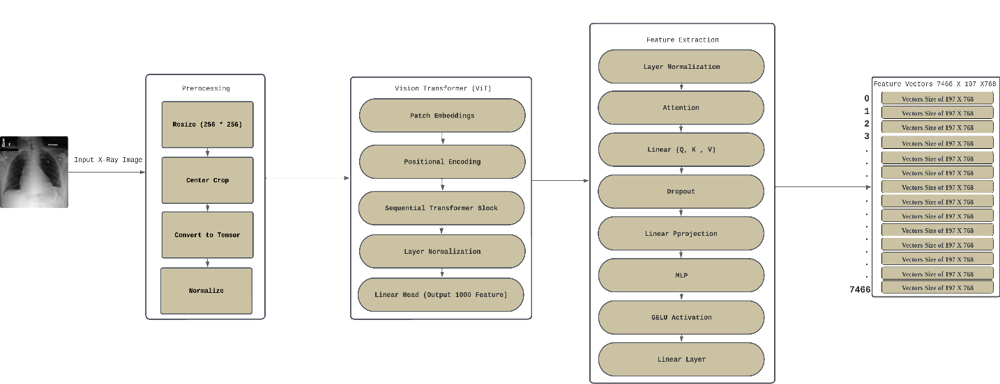
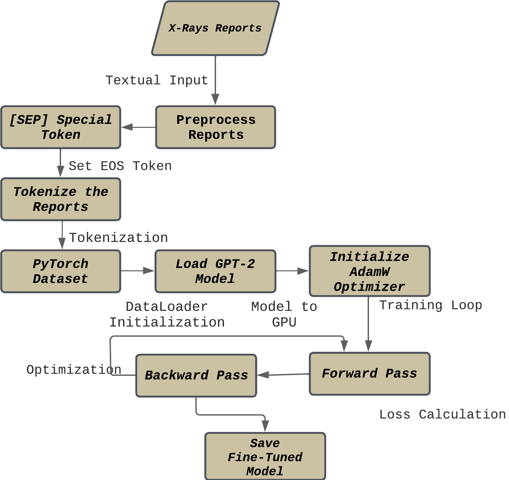
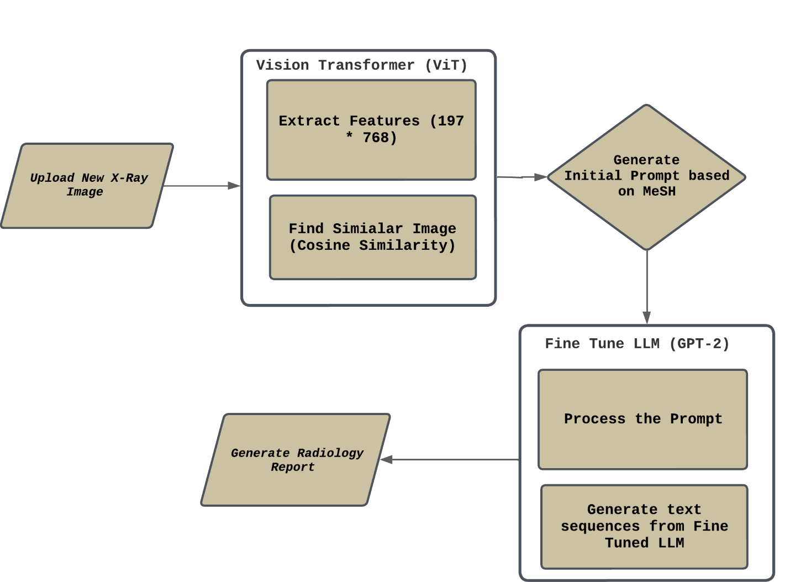

# 🚀 RadiologyReportGen-AI

<p align="center">
  <b>
    Automated Radiology Report Generation with Vision Transformers & GPT-2
  </b><br>
  <i>
    <a href="docs/22I_0081_Kheem_Thesis_02_Final_Report.pdf">
      
      Read the Full Thesis (FAST NUCES, 2024)
    </a>
  </i>
</p>

---

> _"A Hybrid Approach for Automated Radiology Report Generation and Summarization using Vision Transformers and Language Models"_  
> <sup>By <b>Kheem Parkash Dharmani</b> | Supervised by Dr. Ejaz Ahmed | FAST NUCES Islamabad, 2024</sup>
> [](https://colab.research.google.com/drive/18xiqOf8O8jyCJDK-YLTDDx9PNVbZLsE8?usp=sharing)

---

## 📢 Project Highlights

- **Hybrid Vision-Language Model:** ViT for X-ray image features + fine-tuned GPT-2 for clinical report generation.
- **Research-Driven:** Directly implements the latest peer-reviewed MS Thesis methods.
- **Clinically Relevant:** Delivers detailed, accurate, context-aware radiology reports.
- **Explainable & Modular:** Clean pipeline, highly extendable, code fully documented.
- **Professional Portfolio:** Production-grade repository for real-world, research, or demo use.

---

## 📷 Screenshots & Visuals

|                  System Architecture                   |                               Example Output                                |
| :----------------------------------------------------: | :-------------------------------------------------------------------------: |
|  |  |

---

## 🧑‍🔬 Overview

RadiologyReportGen-AI is a robust deep learning pipeline for automated generation of chest X-ray radiology reports, combining **Vision Transformers (ViT)** for high-fidelity image analysis and a **fine-tuned GPT-2** for natural language report generation.  
All methodology is grounded in [this MS Thesis (2024)](screenshots/thesis_cover.png) and addresses major clinical and computational challenges in AI-based radiology.

---

## 🗂️ Table of Contents

- [Project Highlights](#project-highlights)
- [Screenshots & Visuals](#screenshots--visuals)
- [Overview](#overview)
- [System Architecture](#system-architecture)
- [Methodology](#methodology)
- [Dataset](#dataset)
- [Installation](#installation)
- [Quickstart Usage](#quickstart-usage)
- [Project Structure](#project-structure)
- [Results & Evaluation](#results--evaluation)
- [Tips for Reproducibility & Extension](#tips-for-reproducibility--extension)
- [References](#references)
- [License](#license)
- [Contact & Acknowledgements](#contact--acknowledgements)

---

## 🏗️ System Architecture

### Workflow Diagram







**Main Steps:**

1. **Input:** Chest X-ray image.
2. **Preprocessing:** Resize, crop, normalize.
3. **Feature Extraction:** ViT encodes the image.
4. **Similarity Matching:** Cosine similarity to database features.
5. **Prompt Construction:** Most similar image’s MeSH/clinical findings used as GPT-2 prompt.
6. **Report Generation:** Fine-tuned GPT-2 generates detailed radiology report.

---

## ⚙️ Methodology

### 1. Data Preprocessing

- Merges Indiana OpenI datasets, cleans and structures report text, applies standard image preprocessing.

### 2. Feature Extraction (Vision Transformer)

- Leverages a ViT base model (patch size 16x224), extracting 768-dim features per patch for every X-ray.
- Efficient GPU processing for large datasets.

### 3. Language Model Fine-Tuning (GPT-2)

- GPT-2 model is fine-tuned on cleaned radiology reports for coherent, clinical text.
- Uses custom dataset, batching, and loss monitoring.

### 4. Multimodal Integration

- New X-rays are matched by feature similarity; MeSH terms from the most similar image act as GPT-2 prompts.
- Generated report is closely tied to actual radiological findings.

### 5. Evaluation

- Automatic scoring: **Perplexity**, **BLEU**, **ROUGE**, **BERTScore**.
- Visual analysis: t-SNE feature plots, loss curves, word clouds.

---

## 🏥 Dataset

- **Source:** [Indiana University Chest X-ray OpenI](https://openi.nlm.nih.gov/)
- **Included:** PNG images, `indiana_reports.csv`, `indiana_projections.csv`
- **Data Path:** Place all data inside `/data/` (see below).
- **Privacy:** Fully anonymized, public research dataset.

---

## 🚀 Installation

**Prerequisites:**

- Python 3.10+
- CUDA-enabled GPU recommended

**Clone and Install:**

```bash
git clone https://github.com/Kheem-Dh/RadiologyReportGen-AI.git
cd RadiologyReportGen-AI
pip install -r requirements.txt
```

---

## ⚡ Quickstart Usage

1. **Preprocess Data**

   ```bash
   python scripts/preprocess_data.py
   ```

2. **Extract ViT Features**

   ```bash
   python scripts/extract_features.py
   ```

3. **Fine-Tune GPT-2**

   ```bash
   python scripts/train_gpt2.py
   ```

4. **Generate a Report**

   ```bash
   python scripts/generate_report.py
   ```

5. **Evaluate Performance**

   ```bash
   python scripts/evaluate.py
   ```

---

## 📁 Project Structure

```
RadiologyReportGen-AI/
├── data/                  # Place your dataset files and images here
│   ├── indiana_reports.csv
│   ├── indiana_projections.csv
│   └── images/
├── screenshots/           # Place all screenshots and diagrams here
├── notebooks/
│   └── Radiology_Report_Generation.ipynb
├── src/
│   ├── data_preprocessing.py
│   ├── feature_extraction.py
│   ├── report_generation.py
│   ├── integration.py
│   ├── evaluation.py
│   └── utils.py
├── scripts/
│   ├── preprocess_data.py
│   ├── extract_features.py
│   ├── train_gpt2.py
│   ├── generate_report.py
│   └── evaluate.py
├── requirements.txt
├── README.md
└── LICENSE
```

---

## 📊 Results & Evaluation

- **Quantitative Metrics**

  - Perplexity: _Lower = better model confidence_
  - BLEU, ROUGE, BERTScore: _High scores show strong clinical and linguistic relevance_

- **Qualitative**

  - Reports accurately reflect findings, impressions, and medical context.
  - Handles complex or rare cases effectively.

**Sample Evaluation Table:**

| Example | BLEU | ROUGE-1 | BERTScore F1 | Report Quality |
| ------- | ---- | ------- | ------------ | -------------- |
| 1       | 0.14 | 1.00    | 0.91         | Excellent      |
| 2       | 0.32 | 1.00    | 0.83         | Excellent      |

---

## 📝 Tips for Reproducibility & Extension

- **Use a virtual environment** (venv or conda) for clean installs.
- **Place only small sample data in repo;** large datasets should be referenced via `/data/`.
- **Add your own X-ray images** for demo by dropping them in `/data/images/` and updating paths.
- **Save your generated outputs** (loss curves, t-SNE, report examples) in `/screenshots/` for your portfolio.
- **Notebook for EDA & Exploration:** Use the provided Jupyter notebook for visualization, prototyping, and presentation.
- **Colab Demo:** Add a Colab badge for quick web-based demos (see badge at top).
- **Extend for new tasks:** The modular `/src/` codebase can be adapted for MRI, CT, or other modalities with minimal changes.

---

## 📑 Thesis

- **Full MS Thesis PDF:**  
  [A Hybrid Approach for Automated Radiology Report Generation and Summarization using Vision Transformers and Language Models](docs/22I_0081_Kheem_Thesis_02_Final_Report.pdf)  
  _by Kheem Parkash Dharmani, FAST NUCES, Islamabad, 2024._

_See the thesis for full methodology, extended results, and complete reference list._

## 📚 References

_See the [full thesis PDF](docs/22I_0081_Kheem_Thesis_02_Final_Report.pdf) for the complete reference list and in-depth literature review._

1. Mohsan, M. M., Akram, M. U., et al. "Vision Transformer and Language Model Based Radiology Report Generation." IEEE Access, 2022.
2. Li, M., Liu, R., Wang, F., et al. "Auxiliary signal-guided knowledge encoder-decoder for medical report generation." WWW, 2023.
3. Sirshar, M., Paracha, M. F. K., et al. "Attention based automated radiology report generation using CNN and LSTM." PLOS ONE, 2022.
4. \[Full reference list in thesis and `REFERENCES.md` if desired.]

---

## 📃 License

[MIT License](./LICENSE)

---

## 🤝 Contact & Acknowledgements

**Author:**
Kheem Parkash Dharmani
MS Data Science, FAST NUCES Islamabad
_Supervisor: Dr. Ejaz Ahmed_

**Acknowledgements:**
Dr. Ahmad Raza Shahid, family, mentors, and the FAST NUCES community.

**For Questions, Issues, or Collaboration:**

- Open an [Issue](https://github.com/Kheem-Dh/RadiologyReportGen-AI/issues)
- Connect on [LinkedIn](https://www.linkedin.com/in/kheemparkashdharmani/)

---

> _This repository is based on the MS Thesis: "A Hybrid Approach for Automated Radiology Report Generation and Summarization using Vision Transformers and Language Models", 2024._

---
